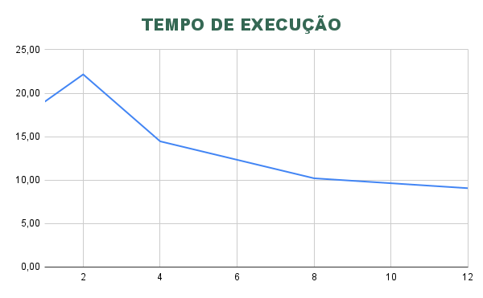
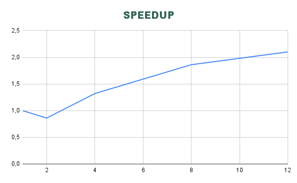
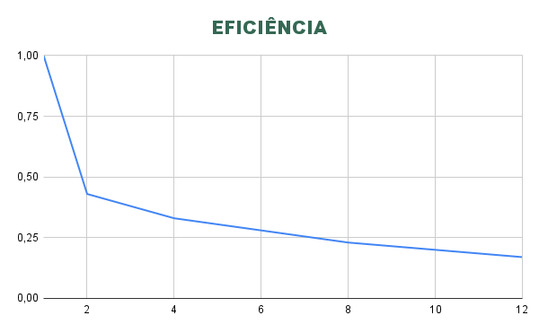

# Relatório de Avaliação de Performance - MPI

**Disciplina:** Sistemas Distribuídos / Programação Concorrente
**Aluno(s):** Samuel de Souza Rodrigues
**Turma:** 5º Semestre - Análise e Desenvolvimento de Sistemas
**Professor:** Rafael
**Data:** 10 de abril de 2026

---

# 1. Descrição do Problema

O problema computacional resolvido consiste na análise de similaridade entre pares de perguntas de um dataset real ("Quora Question Pairs"). O objetivo é identificar o grau de semelhança entre textos para detectar possíveis duplicatas.

* **Problema implementado:** Identificação de similaridade textual através da comparação de strings normalizadas e tokenizadas.
* **Algoritmo utilizado:** Similaridade de Jaccard, que calcula a razão entre a interseção e a união dos conjuntos de palavras (tokens) de duas frases.
* **Tamanho da entrada:** 5.000 perguntas únicas, gerando um total de 12.492.501 comparações de pares ($n \times (n-1) / 2$).
* **Objetivo da paralelização:** Reduzir o tempo de processamento de um algoritmo de complexidade quadrática $O(n^2)$, distribuindo a carga de trabalho do laço de comparação entre múltiplos núcleos de processamento.

---

# 2. Ambiente Experimental

Os experimentos foram realizados em hardware local com as seguintes especificações:

| Item                        | Descrição |
| --------------------------- | --------- |
| Processador                 | AMD Ryzen 5 7600X (4.70 GHz) |
| Número de núcleos           | 6 núcleos físicos / 12 threads (SMT) |
| Memória RAM                 | 16,0 GB (15,2 GB utilizável) |
| Sistema Operacional         | Windows 11 Pro (64-bit) |
| Linguagem utilizada         | Python 3.x |
| Biblioteca de paralelização | mpi4py, pandas |
| Compilador / Versão         | Microsoft MPI (MS-MPI) |

---

# 3. Metodologia de Testes

* **Medição de tempo:** O tempo foi medido utilizando a função `time.time()` do Python, capturando o intervalo real decorrido (*wall-clock time*) desde o início da carga de dados até a finalização da coleta dos resultados.
* **Quantidade de execuções:** Foi realizada uma execução completa para cada configuração de processos.
* **Tamanho da entrada:** Fixado em 5.000 linhas do dataset original para garantir a consistência das métricas.

### Configurações testadas

* 1 processo (versão serial original `avaliador.py`)
* 2 processos (MPI)
* 4 processos (MPI)
* 8 processos (MPI)
* 12 processos (MPI)

---

# 4. Resultados Experimentais

Tempos obtidos durante a execução dos testes:

| Nº Threads/Processos | Tempo de Execução (s) |
| -------------------- | --------------------- |
| 1 (Serial)           | 19.02                 |
| 2                    | 22.16                 |
| 4                    | 14.46                 |
| 8                    | 10.21                 |
| 12                   | 9.07                  |

---

# 5. Cálculo de Speedup e Eficiência

### Speedup
Speedup(p) = T(1) / T(p)

Mede o quanto a execução paralela é mais rápida que a serial.

### Eficiência
Eficiência(p) = Speedup(p) / p

Mede o aproveitamento individual de cada processador alocado.

---

# 6. Tabela de Resultados

| Threads/Processos | Tempo (s) | Speedup | Eficiência |
| ----------------- | --------- | ------- | ---------- |
| 1                 | 19.02     | 1.00    | 1.00       |
| 2                 | 22.16     | 0.86    | 0.43       |
| 4                 | 14.46     | 1.32    | 0.33       |
| 8                 | 10.21     | 1.86    | 0.23       |
| 12                | 9.07      | 2.10    | 0.17       |

---

# 7. Gráfico de Tempo de Execução

*(Tendência: Queda acentuada de 1 para 12 processos, com exceção da anomalia em 2 processos).*

---

# 8. Gráfico de Speedup

*(Tendência: Crescimento abaixo da linha ideal de 45 graus).*

---

# 9. Gráfico de Eficiência

*(Tendência: Curva descendente conforme o número de processos aumenta).*

---

# 10. Análise dos Resultados

* **O speedup foi próximo do ideal?** Não. Para 12 processos, o speedup ideal seria 12x, mas o obtido foi de 2.10x.
* **A aplicação apresentou escalabilidade?** Sim, o tempo continuou caindo até 12 processos, porém de forma sublinear.
* **Overhead de Paralelização:** O caso de 2 processos (22.16s) foi mais lento que o serial (19.02s). Isso ocorre devido ao custo de comunicação: o tempo necessário para o MPI gerenciar os processos e o `comm.gather()` coletar milhões de resultados na memória foi maior que o ganho de processamento distribuído.
* **Gargalos:** O principal gargalo identificado é a centralização dos dados no processo mestre (Rank 0). Enviar 12,4 milhões de dicionários via rede/memória gera uma contenção severa de memória e latência de comunicação.
* **Capacidade de Hardware:** Como a máquina possui 6 núcleos físicos, ao rodar 12 processos, o sistema utiliza *Hyperthreading* (núcleos lógicos), o que aumenta a concorrência por recursos de cache e memória, degradando a eficiência.

---

# 11. Conclusão

O experimento demonstra que o paralelismo com MPI é eficaz para reduzir o tempo total de processamento de grandes volumes de dados (redução de ~52% entre serial e 12 processos). 

Entretanto, para este algoritmo específico, o custo de sincronização e transferência de dados é muito alto. O melhor cenário em termos de tempo absoluto foi com 12 processos, mas a melhor relação custo-benefício (eficiência) ocorreu com 4 processos.

Como melhoria, sugere-se que cada processo realize uma filtragem local (ex: retornar apenas as top 20 similaridades) antes de enviar os dados ao processo mestre, reduzindo drasticamente o volume de dados trafegados e elevando o speedup.
